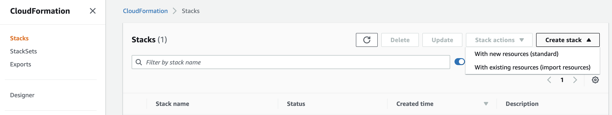
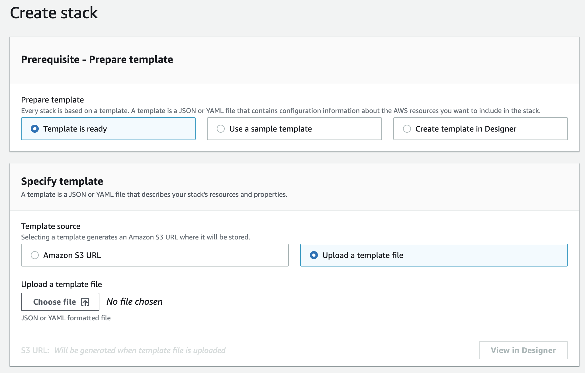

# 4.0 Deploying with IaC

Infrastructure as code is the process of provisioning and managing your cloud resources by writing a template file that is both human readable, and machine consumable. Compared to using graphical user interface which may not be maintainable and extensible, which makes cleaning up very tedious as well. For AWS cloud development the built-in choice for infrastructure as code is AWS CloudFormation.

List of IAC Tools:
1. AWS Cloudformation (We will be using this!)
2. Terraform
3. Ansible
4. Chef
5. Puppet

---

## Why use Infrastructure as Code

1. **Visibility**: An infrastructure as code template serves as a very clear reference of what resources are on your account, and what their settings are. You don’t have to navigate to the web console to check the parameters.
2. **Stability**: If you accidentally change the wrong setting or delete the wrong resource in the web console you can break things. Infrastructure as code helps solve this, especially when it is combined with version control, such as Git.
3. **Scalability**: With infrastructure as code you can write it once and then reuse it many times. This means that one well written template can be used as the basis for multiple services, in multiple regions around the world, making it much easier to horizontally scale.
4. **Security**: Once again infrastructure as code gives you a unified template for how to deploy your architecture. If you create one well secured architecture you can reuse it multiple times, and know that each deployed version is following the same settings.
5. **Transactional**: CloudFormation not only creates resources on your AWS account but also waits for them to stabilize while they start. It verifies that provisioning was successful, and if there is a failure it can gracefully roll the infrastructure back to a past known good state.1.

### Introduction to AWS Cloudformation Template

#### Resources

The Resources object contains a list of resource objects. A resource declaration contains the resource's attributes, which are themselves declared as child objects. A resource must have a Type attribute, which defines the kind of AWS resource you want to create. The Type attribute has a special format:

```
AWS::ProductIdentifier::ResourceType
```

Example of a Cloudformation template to provision an S3 bucket resource
```
Resources:
  MyBucket:
    Type: 'AWS::S3::Bucket'
```

#### Property

Depending on the resource type, some properties are required, such as the ImageId property for an AWS::EC2::Instance resource, and others are optional.

```
Resources:
  MyBucket:
    Type: 'AWS::S3::Bucket'
    Properties:
      AccessControl: PublicRead
```

#### Ref

You're probably wondering how you set properties on one resource based on the name or property of another resource. For example, an EC2 resource that uses a Security Group resource. This is where Ref function is used to **refer** to an identifying property of a reource

```
Resources:
  Ec2Instance:
    Type: 'AWS::EC2::Instance'
    Properties:
      SecurityGroups:
        - !Ref InstanceSecurityGroup
      KeyName: mykey
      ImageId: ''
  InstanceSecurityGroup:
    Type: 'AWS::EC2::SecurityGroup'
    Properties:
      GroupDescription: Enable SSH access via port 22
      SecurityGroupIngress:
        - IpProtocol: tcp
          FromPort: 22
          ToPort: 22
          CidrIp: 0.0.0.0/0
```

#### Output

The Outputs object in the template contains declarations for the values that you want to have available after the stack is created. An output is a convenient way to capture important information about your resources or input parameters. This also means that these output values are visible and can be referenced by other stacks.

```
LoadBalancerListener:
    Description: listener port 80
    Value: !Ref PublicLoadBalancerListener
    Export:
      Name: 'PublicLoadBalancerListener'
```

#### Import

The intrinsic function Fn::ImportValue returns the value of an output exported by another stack. You typically use this function to create cross-stack references. In the following example template snippets, Stack A exports VPC security group values and Stack B imports them.

```
ListenerRule:
    Type: AWS::ElasticLoadBalancingV2::ListenerRule
    Properties:
      ListenerArn: !ImportValue PublicLoadBalancerListener
      Priority: 2
      Conditions:
        - Field: path-pattern
          Values:
            - /*
      Actions:
        - TargetGroupArn: !Ref TargetGroup
          Type: forward
```

#### Instructions

With the above information, we can start writing our own Cloudformation Template.
We will be making use of the infrastructure repository. If you have not done so already, you can run the following command to clone the infrastructure templates into your folder.

```
git clone https://gitlab.com/<your-group-name>/infrastructure.git
```

1. The infrastructure folder consist of 4 parts
    - role-policies.yml: Provison ECS access roles
    - vpc-subnets.yml: Provision VPC and Subnets
    - ecs-cluster.yml: Provision ECS cluster
    - ecs-containers.yml: Provision ECS task definitions

2. Have a look at the role and policies. This cloudformation template will be used to create new roles and give it the permission for ECS to fetch images and log sending. This will be attached to ECS later in the tutorial.

```
AWSTemplateFormatVersion: '2010-09-09'
Description: roles and policies

Resources:
  ECSTaskExecutionRole:
    Type: AWS::IAM::Role
    Properties:
      AssumeRolePolicyDocument:
        Statement:
        - Effect: Allow
          Principal:
            Service: [ecs-tasks.amazonaws.com]
          Action: ['sts:AssumeRole']
      Path: /
      Policies:
        - PolicyName: AmazonECSTaskExecutionRolePolicy
          PolicyDocument:
            Statement:
            - Effect: Allow
              Action:
                # ECS Tasks to download images from ECR
                - 'ecr:GetAuthorizationToken'
                - 'ecr:BatchCheckLayerAvailability'
                - 'ecr:GetDownloadUrlForLayer'
                - 'ecr:BatchGetImage'
                # ECS tasks to upload logs to CloudWatch
                - 'logs:CreateLogStream'
                - 'logs:PutLogEvents'
              Resource: '*'

Outputs:

  ECSTaskExecutionRole:
    Description: ECS Task Execution Role
    Value: !GetAtt 'ECSTaskExecutionRole.Arn'
    Export:
      Name: 'ECSTaskExecutionRole'
```

3. Now we will upload this template to Cloudformation. Please access to your aws console and upload your template. 

On the top right panel of your console, select `Create Stack`.

Under the specify template, upload the `role-policies.yml` template file.

Give your stack a name and select Next, leave the default settings.
This should kick of the resource provisioning process.

You may look into IAM role on AWS to validate the role created from your template

---