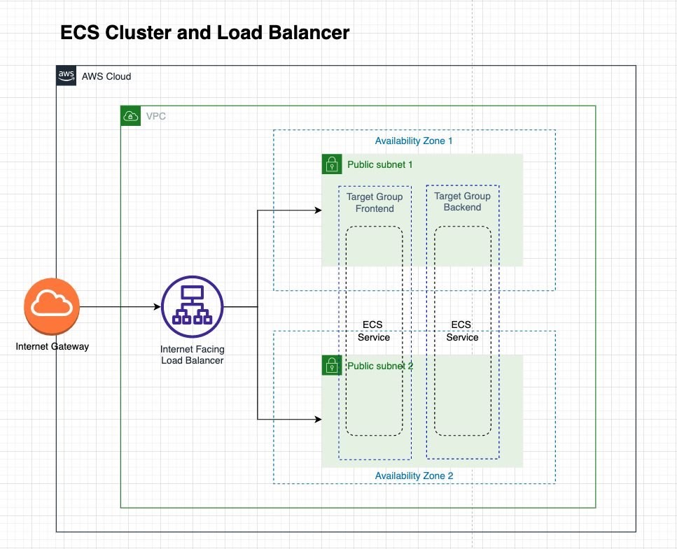

# 4.2 ECS Cluster

An Amazon ECS cluster is a logical grouping of tasks or services. Your tasks and services are run on infrastructure that is registered to a cluster. The infrastructure capacity can be provided by AWS Fargate, which is serverless infrastructure that AWS manages, Amazon EC2 instances that you manage, or an on-premise server or virtual machine (VM) that you manage remotely.

### ECS Fargate Vs ECS EC2

#### EC2: 
- Deploy and manage your own cluster of EC2 instances for running the containers
- Bill by underlying EC2 instance lauch type
#### Fargate: 
- Run containers directly, without any EC2 instances
- Bill by CPU cores, and gigabytes of memory your task requires

### Load Balancer and Target Groups

Elastic Load Balancing (ELB) automatically distributes incoming application traffic across multiple targets and virtual appliances in one or more Availability Zones (AZs).

Each target group is used to route requests to one or more registered targets. When you create each listener rule, you specify a target group and conditions. When a rule condition is met, traffic is forwarded to the corresponding target group

---
#### Instructions

Now we will take a look at `ecs-cluster.yml` to understand the creation of our ECS Clusters, Load Balancers and Target Groups.

```
AWSTemplateFormatVersion: '2010-09-09'
Description: container cluster on ECS and loadbalancer

Resources:

  ECSCluster:
    Type: AWS::ECS::Cluster
    Properties:
      ClusterName: 'bootcamp-demo-application'
  
  # A security group for the containers we will run in Fargate.
  # allowing network traffic from a public facing loadbalancer, 
  FargateContainerSecurityGroup:
    Type: AWS::EC2::SecurityGroup
    Properties:
      GroupDescription: Access to fargate containers
      VpcId: !ImportValue 'VPC'
  
  EcsSecurityGroupIngressFromPublicALB:
    Type: AWS::EC2::SecurityGroupIngress
    Properties:
      Description: Ingress from public ALB
      GroupId: !Ref 'FargateContainerSecurityGroup'
      SourceSecurityGroupId: !Ref 'PublicLoadBalancerSecurityGroup'
      IpProtocol: -1

  # A public facing load balancer, this is used for accepting traffic from the public
  # internet and directing it to public facing microservices
  PublicLoadBalancerSecurityGroup:
    Type: AWS::EC2::SecurityGroup
    Properties:
      GroupDescription: Security group for loadbalancer to services on ECS
      VpcId: !ImportValue 'VPC'
      SecurityGroupIngress:
        # Allow access to ALB from anywhere on the internet
        - CidrIp: 0.0.0.0/0
          IpProtocol: -1
  
  PublicLoadBalancer:
    Type: AWS::ElasticLoadBalancingV2::LoadBalancer
    Properties:
      Name: 'public-ecs-services'
      Scheme: internet-facing
      Subnets:
        # The load balancer is placed into the public subnets, so that traffic
        # from the internet can reach the load balancer directly via the internet gateway
        - !ImportValue 'PublicSubnet1'
        - !ImportValue 'PublicSubnet2'
      SecurityGroups:
        - !Ref 'PublicLoadBalancerSecurityGroup'
  
  # A target group tells a load balancer where to drop traffic to
  # Healthcheck is set to run check on the frontend endpoint
  # It will attempt to re-register the ecs service if unhealthy 
  PublicTargetGroupFrontend:
    Type: AWS::ElasticLoadBalancingV2::TargetGroup
    Properties:
      Name: frontend-tg
      VpcId: !ImportValue VPC
      # This will create a frontend target group to direct user to the frontend application
      Port: 3000
      Protocol: HTTP
      Matcher:
        HttpCode: 200-399
      HealthCheckIntervalSeconds: 60
      HealthCheckPath: /
      HealthCheckProtocol: HTTP
      HealthCheckTimeoutSeconds: 10
      HealthyThresholdCount: 10
      TargetType: ip
  
  # A target group tells a load balancer where to drop traffic to
  # Healthcheck is set to run check on the backend endpoint
  # It will attempt to re-register the ecs service if unhealthy
  PublicTargetGroupBackend:
    Type: AWS::ElasticLoadBalancingV2::TargetGroup
    Properties:
      Name: backend-tg
      VpcId: !ImportValue VPC
      # This will create a backend target group to direct user to the backend application
      Port: 9000
      Protocol: HTTP
      Matcher:
        HttpCode: 200-399
      HealthCheckIntervalSeconds: 60
      HealthCheckPath: /api/todos
      HealthCheckProtocol: HTTP
      HealthCheckTimeoutSeconds: 10
      HealthyThresholdCount: 10
      TargetType: ip
  
  # The Load Balancer will automatically distribute incoming application traffic across 
  # multiple targets and virtual appliances in one or more Availability Zones (AZs).
  PublicLoadBalancerListener:
    Type: AWS::ElasticLoadBalancingV2::Listener
    DependsOn:
      - PublicLoadBalancer
    Properties:
      LoadBalancerArn: !Ref 'PublicLoadBalancer'
      Protocol: HTTP
      Port: 80
      DefaultActions:
        - Type: forward
          TargetGroupArn: !Ref 'PublicTargetGroupFrontend'

Outputs:
  
  Cluster:
    Value: !Ref ECSCluster
    Export:
      Name: 'ECSCluster'

  PublicLoadBalancerListener:
    Description: listener port 80
    Value: !Ref PublicLoadBalancerListener
    Export:
      Name: 'PublicLoadBalancerListener'

  FargateContainerSecurityGroup:
    Description: A security group used to allow Fargate containers to receive traffic
    Value: !Ref FargateContainerSecurityGroup
    Export:
      Name: 'FargateContainerSecurityGroup'

  PublicLoadBalancerDNS:
    Description: Domain name for the public loadbalancer
    Value: !GetAtt PublicLoadBalancer.DNSName
    Export:
      Name: 'PublicDomainName'

  PublicTargetGroupFrontend:
    Description: Target group pointing to frontend service
    Value: !Ref PublicTargetGroupFrontend
    Export:
      Name: 'PublicTargetGroupFrontend'

  PublicTargetGroupBackend:
    Description: Target group pointing to backend service
    Value: !Ref PublicTargetGroupBackend
    Export:
      Name: 'PublicTargetGroupBackend'
```
---

Proceed to upload this template to Cloudformation to provision our ECS Cluster layer and setup the loadbalancer traffic distribution. The following is a high level diagram to illustrate what you have just built.

