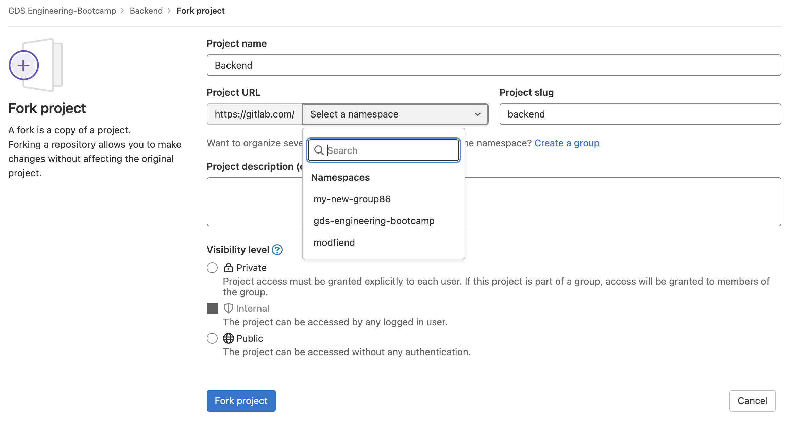

# 0. Getting Started

## Launching the development environment

> 💡 Prerequisite: Do ensure you have [Docker](https://www.docker.com/get-started) installed on your local machine! Also, make sure that Docker desktop is running on the background!

1. Frontend: https://gitlab.com/gds-engineering-bootcamp/frontend
2. Backend: https://gitlab.com/gds-engineering-bootcamp/backend
3. Infrastructure: https://gitlab.com/gds-engineering-bootcamp/infrastructure
4. Templates: https://gitlab.com/gds-engineering-bootcamp/templates

> Fork the above Repositories into your own Gitlab group

1. Click on the fork button as below


2. Create a new group by clicking on the `Create a group` button 


3. Click on `Create group`


4. Give your new group a `Group Name`


5. Click on `Create group` button and your new group will be created! :D


6. Your new group will now show under the `Select a namespace` dropdown list


Let's get things up and running!

Firstly, clone this repository and navigate into the main codebase

```console
mkdir eng-bootcamp-2022 &&
cd eng-bootcamp-2022 &&
git clone https://gitlab.com/<your-group-name>/backend.git &&
git clone https://gitlab.com/<your-group-name>/frontend.git &&
git clone https://gitlab.com/<your-group-name>/infrastructure.git &&
```

Checkout to the exercise branch in Backend and Frontend applications

> cd into directories backend and frontend and run the commands below


```console
git checkout checkpoint-0
```

Run the command below:

Install jest to run tests
```console
npm i --save-dev @types/jest
```

Start the servers
```console
docker-compose up --build
```

If running docker compose in detached mode instead (`docker-compose up --build --detach`), viewing the logs of a container is simple:

```console
docker logs frontend_frontend_1
```

```console
docker logs backend_backend_1
```

To tear down the environment:

```console
docker-compose down
```

If all is good, access the locally hosted front end app at `http://localhost:3000/`


You should arrive at this screen